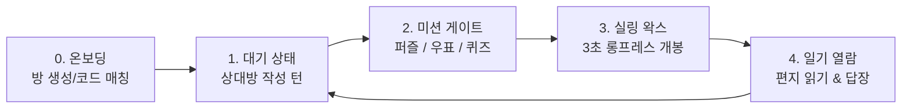

# 온기 (Warmth) — 둘만의 비밀 교환일기 💌

<p align="center">
  
</p>

<p align="center">
  <strong>"하루걸러 띄우는, 우리 둘만을 위한 아날로그 비밀 교환일기"</strong><br />
  디지털 메신저의 빠른 대화 속에서 잊혀져 가던 기다림의 설렘과 손편지의 따스한 온기를 다시 전합니다.
</p>

<p align="center">
  <a href="https://meisteryi.github.io/Warmth/"></a>
  
  
  
  
</p>

---

## ✨ 핵심 기능 (Key Features)

### 🕯️ 3초 롱프레스 실링 왁스 개봉
- 상대방이 부친 편지 봉투의 실링 왁스를 **3초 동안 꾹 누르면(Long-press)**, 붉은 왁스가 지그시 녹아내리며 파열되는 시각적·청각적 피드백을 제공합니다.
- **Web Audio API 합성 엔진**: 실제 왁스가 지글거리며 녹는 저주파 험(`Melt Hum`)과 쩍 갈라지는 타격음(`Wax Crack`), 햅틱 진동을 실시간 합성하여 완벽한 촉각적 몰입감을 구현했습니다.

### 🧩 3가지 잠금 해제 관문 (Unlock Gates)
일기를 열어보기 전, 상대방이 지정한 특별한 관문을 직접 풀어야만 봉인을 해제할 수 있습니다:

1. **🧩 사진 조각 퍼즐 (Photo Sliding Puzzle)**
   - 상대방이 일기에 첨부한 소중한 사진이 3×3 슬라이딩 조각으로 분리됩니다.
   - 1px 헤어라인의 매끄러운 틈새와 부드러운 드래그/슬라이드 인터랙션으로 사진을 완성합니다.
2. **📮 우표 맞추기 (Torn Stamp Jigsaw Puzzle)**
   - 대한제국 앤틱 우표(`大韓 溫氣 郵便 42 WON`)가 절차적(Procedural) 알고리즘으로 무작위 찢겨져 흩어집니다.
   - 조각마다 달린 `[🔄]` 버튼으로 **조각 자체의 중심축을 기준으로 시계 방향 회전**시키고, 올바른 각도와 위치로 틀에 끌어다 놓아야만 착 결합됩니다.
   - 4조각이 모두 맞춰지면 **묵직한 소인 도장 타격음(`쿵!`)과 컨페티**가 터집니다.
3. **❓ 깜짝 퀴즈 (Surprise Quiz)**
   - 상대방이 남긴 소소한 TMI 질문이나 둘만의 추억 퀴즈를 맞히는 모드입니다.
   - 오답 시 친절한 힌트가 제공되며, 정답을 입력하면 즉시 봉인이 풀립니다.

### 📜 편안한 아날로그 서재 감성 디자인
- 고급 리넨 한지 질감 바탕, **마루부리(MaruBuri)** 및 **고운바탕(Gowun Batang)** 명조 계열 폰트 적용.
- 버건디 와인(`#6B1724`), 고서 잉크(`#2C2A29`), 앤틱 골드(`#B8860B`)의 조화로운 컬러 팔레트.

### 🔒 Firebase 실시간 1:1 교환 동기화
- 6자리 초대 코드로 서로를 한 번만 연결하면, 둘만의 전용 방(`rooms/{roomCode}`)이 개설됩니다.
- 한 사람이 일기를 써서 봉인하면 상대방 화면이 즉시 `도착한 편지 대기` 상태로 전환되는 턴제 아키텍처.

---

## 🔄 5단계 상태 머신 (State Flow)



| 상태 | 화면 설명 |
|---|---|
| `VIEW_ONBOARDING` | 6자리 방 코드 발급 및 파트너 코드 입력을 통한 1:1 일기장 매칭 |
| `VIEW_WAITING` | 상대방이 일기를 쓰는 동안 기다리는 편지함 화면 (따뜻한 대기 문구) |
| `VIEW_SEALED_LETTER` | 편지가 도착했으나, 3대 관문(퍼즐/우표/퀴즈)을 풀어야 하는 상태 |
| `VIEW_WAX_READY` | 관문 통과 후, 실링 왁스를 3초간 롱프레스하여 봉인을 뜯는 단계 |
| `VIEW_OPENED_DIARY` | 봉인이 해제되어 상대방의 진심 어린 일기와 사진을 읽고 답장을 남기는 화면 |

---

## 🛠 기술 스택 (Tech Stack)

| 분류 | 기술 |
|---|---|
| **Frontend Framework** | **Next.js 16 (App Router, Turbopack)** |
| **Language** | **TypeScript 5** |
| **Styling** | **Tailwind CSS v4, Vanilla CSS Design System** |
| **Animation & Gestures** | **Framer Motion, Canvas-Confetti** |
| **Audio Engine** | **Web Audio API (Procedural Sound Synthesis)** |
| **Backend & Database** | **Firebase Cloud Firestore, Firebase Hosting** |
| **Icons & Typography** | **Lucide React, Google Fonts (MaruBuri, Gowun Batang)** |
| **CI / CD** | **GitHub Actions → GitHub Pages (`output: export`)** |

---

## 🚀 로컬 실행 방법 (Getting Started)

### 1. 저장소 클론 및 패키지 설치
```bash
git clone https://github.com/meisteryi/Warmth.git
cd Warmth
npm install
```

### 2. 환경 변수 설정
프로젝트 루트 경로에 `.env.local` 파일을 생성하고 Firebase 프로젝트 키를 입력합니다:
```env
NEXT_PUBLIC_FIREBASE_API_KEY=your_api_key
NEXT_PUBLIC_FIREBASE_AUTH_DOMAIN=your_project.firebaseapp.com
NEXT_PUBLIC_FIREBASE_PROJECT_ID=your_project_id
NEXT_PUBLIC_FIREBASE_STORAGE_BUCKET=your_project.firebasestorage.app
NEXT_PUBLIC_FIREBASE_MESSAGING_SENDER_ID=your_messaging_sender_id
NEXT_PUBLIC_FIREBASE_APP_ID=your_app_id
```

### 3. 개발 서버 실행
```bash
npm run dev
```
브라우저에서 `http://localhost:3000`으로 접속하여 즉시 테스트할 수 있습니다.

### 4. 정적 빌드 및 내보내기 검증
```bash
npm run build
```

---

## 📁 디렉토리 구조 (Project Structure)

```text
Warmth/
├── .github/workflows/       # GitHub Actions 자동 배포 파이프라인 (deploy.yml)
├── src/
│   ├── app/
│   │   ├── globals.css      # 리넨 한지 질감 및 커스텀 폰트, 실링 왁스 애니메이션
│   │   ├── layout.tsx       # 메타데이터 및 뷰포트 설정
│   │   └── page.tsx         # 5단계 UI 상태 머신 및 메인 오케스트레이터
│   ├── components/
│   │   ├── Envelope.tsx          # 빈티지 편지 봉투 렌더러
│   │   ├── MissionModal.tsx      # 관문 선택 팝업 (사진 퍼즐 / 우표 맞추기 / 깜짝 퀴즈)
│   │   ├── OnboardingView.tsx    # 방 생성 및 6자리 페어링 화면
│   │   ├── OpenedLetter.tsx      # 개봉된 편지 열람 및 답장 뷰어
│   │   ├── PhotoSlidingPuzzle.tsx# 3×3 심리스 사진 슬라이딩 퍼즐
│   │   ├── RoomHeader.tsx        # 상단 커플 상태 바 및 데모 상태 컨트롤러
│   │   ├── StampJigsawPuzzle.tsx # 4조각 절차적 찢김 우표 직소 퍼즐
│   │   ├── WaitingLetter.tsx     # 상대방 턴 대기 화면
│   │   ├── WaxSeal.tsx           # 3초 롱프레스 실링 왁스 인터랙션 컴포넌트
│   │   └── WriteDiaryModal.tsx   # 일기 작성 및 관문 지정 모달
│   ├── lib/
│   │   ├── audio.ts         # Web Audio API 사운드 합성기 (왁스 험, 균열음, 타격음)
│   │   ├── firebase.ts      # Firebase SDK 클라이언트 초기화
│   │   └── roomService.ts   # Firestore 방 및 일기 실시간 CRUD 서비스
│   └── types/
│       └── diary.ts         # TypeScript 인터페이스 (DiaryData, UIState, MissionData 등)
├── firestore.rules          # Firestore 읽기/쓰기 보안 규칙
├── next.config.ts           # GitHub Pages 정적 배포 설정 (basePath, export)
└── README.md
```

---

## 📜 라이선스 (License)

This project is licensed under the MIT License.
Copyright (c) 2026 meisteryi. All rights reserved.
