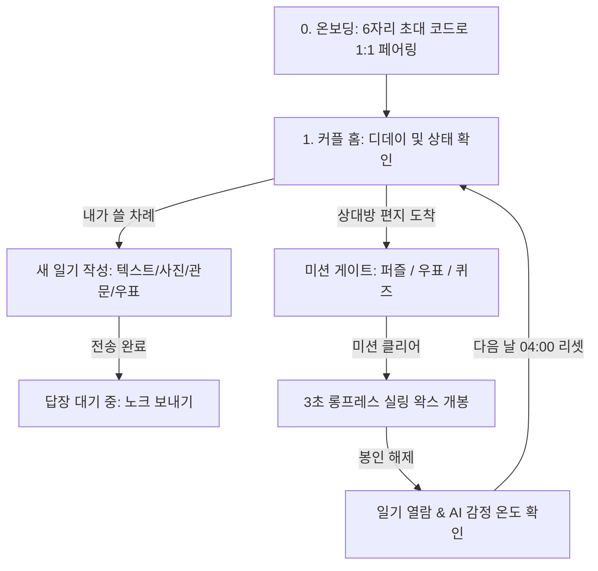

# 💌 온기 (Warmth) — 둘만의 아날로그 비밀 교환일기

<p align="center">
  
</p>

<p align="center">
  <strong>"하루걸러 띄우는, 우리 둘만을 위한 아날로그 비밀 교환일기"</strong><br />
  인스턴트 메신저의 빠른 대화 속에서 잊혀져 가던 기다림의 설렘과 손편지의 따스한 온기를 다시 전합니다.
</p>

<p align="center">
  <a href="https://meisteryi.github.io/Warmth/"></a>
  
  
  
  
  
  
</p>

---

## 🌟 실제 서비스 배포 및 운영 (Production & Real-World Users)

> **"소중한 사람들과 실제로 주고받기 위해 만들고 배포한 라이브 프로덕션 웹 애플리케이션입니다."**

단순한 포트폴리오용 토이 프로젝트를 넘어, **실제 연인과 주변 지인 커플들에게 배포하여 실사용 환경에서 지속적으로 피드백을 수렴하며 운영 중**인 서비스입니다.

- **실제 연인들의 목소리를 반영한 사용자 경험(UX)**:
  - 🌙 **매일 새벽 04:00 자동 리셋 시스템**: 밤늦게 귀가해 일기를 쓰는 연인들을 위해 자정이 아닌 새벽 4시를 기준으로 하루 교환 턴이 리셋되도록 설계
  - 📱 **모바일 PWA & Safari 홈 화면 최적화**: iOS Safari의 7일 로컬 데이터 삭제 제약을 극복하고, 네이티브 앱과 같은 전체 화면 경험 및 백그라운드 푸시 알림 제공
  - 🖨️ **모바일 환경 최적화 소책자 인쇄/PDF 저장**: 100일·1주년 기념으로 일기를 종이책처럼 간직하고 싶어 하는 실제 연인들의 피드백을 반영하여 모바일 브라우저 전용 인쇄 브릿지 및 PDF 저장 기능 완비
  - 🔔 **바람 종소리 노크(Knock)**: 편지를 보채지 않고 다정하게 마음을 전할 수 있는 윈드차임 노크 기능 및 실시간 알림
  - 🔒 **스포일러 원천 차단 보안 설계**: 개발자 도구(F12/Network)로 상대방의 미개봉 편지를 미리 엿볼 수 없도록 클라이언트 메모리 레벨에서 본문과 사진을 완전 마스킹 처리

---

## ✨ 핵심 기능 (Key Features)

### 🕯️ 3초 롱프레스 실링 왁스 개봉
- 편지 봉투에 찍힌 실링 왁스를 **3초 동안 꾹 누르면(Long-press)**, 붉은 왁스가 지그시 녹아내리며 파열되는 시각적·청각적 피드백을 제공합니다.
- **Web Audio API 절차적 사운드 합성**: 실제 왁스가 지글거리며 녹는 저주파 험(`Melt Hum`)과 쩍 갈라지는 타격음(`Wax Crack`), 햅틱 진동을 실시간 합성하여 완벽한 촉각적 몰입감을 선사합니다.

### 🧩 3가지 잠금 해제 관문 (Unlock Gates)
일기를 읽기 전, 편지 작성자가 직접 고른 특별한 관문을 통과해야만 왁스 봉인을 풀 수 있습니다:
1. **🧩 사진 조각 퍼즐 (Photo Sliding Puzzle)**: 일기에 첨부한 소중한 추억 사진이 3×3 슬라이딩 조각으로 분리되어 손끝으로 맞추는 퍼즐.
2. **📮 빈티지 우표 맞추기 (Torn Stamp Jigsaw Puzzle)**: 대한제국 앤틱 우표(`大韓 溫氣 郵便 42 WON`)가 무작위로 찢겨져 흩어지며, 조각 회전과 결합을 통해 완성하는 감성 퍼즐.
3. **❓ 깜짝 퀴즈 (Surprise Quiz)**: "오늘 내가 점심에 먹은 메뉴는?", "우리가 처음 만났던 카페 이름은?" 등 둘만의 소소한 TMI 퀴즈를 풀고 힌트를 확인하는 모드.

### 🌡️ 텍스트 전체 분위기를 읽어내는 Gemini AI 감정 온도계
- **공기감과 뉘앙스(Vibe & Atmosphere) 종합 평가**: 단순히 '사랑해', '고마워' 같은 직접적인 단어만 카운팅하지 않고, 날씨·창밖 풍경·커피 향·골목길 산책 등 **글 전체에서 느껴지는 서사와 따뜻한 공기감**을 Gemini 2.5 Flash Lite 모델이 입체적으로 분석합니다.
- **-20.0°C ~ 40.0°C 감정 온도**: 시리고 지친 날의 위로(-20°C~0°C)부터 은은한 평온(15°C~25.9°C), 뜨거운 사랑(34°C~40°C)까지 측정.
- **시적 한 줄 코멘트 & 감성 해시태그**: 글의 분위기를 함축한 25자 이내의 다정한 코멘트와 해시태그를 일기에 헌사합니다.

### 📖 둘만의 서재 & 월간 온기 리포트 & 소책자 PDF 인쇄
- **둘만의 보관함**: 날짜별, 작성자별로 서로 주고받은 지난 편지들을 언제든 꺼내 읽을 수 있는 양장본 서재.
- **월간 온기 리포트**: 한 달 동안 둘이 나눈 평균 온도 추이, 가장 따뜻했던 날의 기록 분석.
- **소책자 PDF / 인쇄**: 감성적인 북릿 형태로 둘만의 교환일기를 실제 종이에 인쇄하거나 PDF로 영구 소장 가능.

### 🍃 스르륵 감성 애니메이션 & 아날로그 사운드
- **부드러운 전환 연출**: `Framer Motion`과 `AnimatePresence`를 통해 모든 팝업 모달과 화면 전환이 마치 한 장의 종이가 스르륵 펼쳐지듯 매끄럽게 글라이드됩니다.
- **청각적 만족감**: 페이지 넘기는 소리, 사각거리는 펜촉 필기음, 실링 왁스 녹는 소리, 맑은 풍경 종소리 등 고품질 아날로그 효과음 내장.

---

## 🔄 5단계 교환 흐름 (State Machine Flow)



| UI State | 화면 설명 |
|---|---|
| `VIEW_ONBOARDING` | 6자리 방 코드 발급 및 파트너 코드 입력을 통한 1:1 일기장 매칭 |
| `VIEW_HOME` | 우리가 온기로 이어진 지 N일 차 D-Day 및 오늘의 일기 진행 상태를 보여주는 메인 책상 |
| `VIEW_WAITING` | 내가 일기를 보낸 후 상대방의 답장을 기다리는 고요한 편지함 화면 |
| `VIEW_SEALED_LETTER` | 상대방의 편지가 도착했으나, 3대 관문(퍼즐/우표/퀴즈)을 풀어야 하는 봉인 상태 |
| `VIEW_WAX_READY` | 관문 통과 후, 실링 왁스를 3초간 롱프레스하여 봉인을 뜯는 단계 |
| `VIEW_OPENED_DIARY` | 봉인이 해제되어 상대방의 진심 어린 일기와 사진을 읽고 답장을 남기는 화면 |

---

## 🛠 기술 스택 (Tech Stack)

| 구분 | 도입 기술 | 선정 이유 |
|---|---|---|
| **Framework** | **Next.js 16 (App Router, Turbopack)** | 최신 Next.js 고속 빌드 파이프라인 및 정적 웹 내보내기(`output: export`) 최적화 |
| **Language** | **TypeScript 5** | 엄격한 타입 안정성을 통한 일기 데이터 및 상태 머신 신뢰성 확보 |
| **Styling** | **Tailwind CSS v4 & Vanilla CSS** | 리넨 한지 질감(`paper-texture`), 앤틱 실링 왁스 3D 셰이딩, 세밀한 디자인 토큰 구축 |
| **Animation** | **Framer Motion & Canvas-Confetti** | 팝업 및 화면 전환의 서정적인 '스르륵' 글라이드 애니메이션 및 축하 이펙트 |
| **Audio Engine** | **Web Audio API** | 외부 오디오 파일 다운로드 없이 브라우저 내에서 직접 합성하는 저주파 왁스 험 & 파열음 |
| **Database & Sync** | **Firebase Cloud Firestore** | `onSnapshot` 기반의 실시간 1:1 양방향 교환 동기화 및 초대 코드 인덱싱 |
| **AI Analysis** | **Google Gemini API (2.5 Flash Lite)** | 문맥과 정서적 분위기를 포착하는 감정 온도 측정 및 맞춤형 글감 추천 |
| **Push Notification** | **Web Push API & Service Worker** | 모바일 PWA 환경에서 실시간 편지 도착 및 노크 푸시 전달 |
| **Deployment & CI/CD** | **GitHub Actions → GitHub Pages** | 커밋 시 자동 빌드 및 무중단 정적 호스팅 배포 |

---

## 📁 디렉토리 구조 (Project Structure)

```text
Warmth/
├── .github/workflows/          # GitHub Actions 자동 배포 파이프라인 (deploy.yml)
├── public/                     # 정적 에셋, PWA 매니페스트, 사운드, 아이콘
│   ├── manifest.json           # iOS/Android 홈 화면 추가 PWA 설정
│   └── sw.js                   # 백그라운드 웹 푸시 알림 수신 서비스 워커
├── src/
│   ├── app/
│   │   ├── api/                # Gemini AI 및 Web Push 서버리스 엔드포인트
│   │   ├── globals.css         # 리넨 한지 질감, 커스텀 명조 폰트, 실링 왁스 애니메이션
│   │   ├── layout.tsx          # 메타데이터, 뷰포트, PWA 태그
│   │   └── page.tsx            # 메인 상태 머신 오케스트레이터 및 모달 관리
│   ├── components/
│   │   ├── ArchiveModal.tsx         # 둘만의 서재 (보관함, 월간 리포트, 소책자 인쇄)
│   │   ├── EmptyDeskView.tsx        # 첫 일기 작성 전 아늑한 초기 책상 뷰
│   │   ├── Envelope.tsx             # 앤틱 편지 봉투 및 AIR MAIL 소인 스탬프 렌더러
│   │   ├── HomeView.tsx             # 커플 D-Day 메인 카드 및 빠른 액션 홈 화면
│   │   ├── KnockNotificationModal.tsx # 실시간 풍경 종소리 노크 팝업 모달
│   │   ├── MissionModal.tsx         # 3대 봉인 해제 관문 통합 모달
│   │   ├── OnboardingView.tsx       # 6자리 초대코드 발급 및 1:1 매칭 화면
│   │   ├── OpenedLetter.tsx         # 양장 다이어리 내지 편지 뷰어 및 답장 트리거
│   │   ├── PhotoSlidingPuzzle.tsx   # 3×3 심리스 사진 조각 맞추기 관문
│   │   ├── RoomHeader.tsx           # 상단 헤더 (커플명, 초대코드, 음량 조절, 설정)
│   │   ├── StampJigsawPuzzle.tsx    # 4조각 절차적 찢김 우표 직소 퍼즐 관문
│   │   ├── WaitingLetter.tsx        # 상대방 턴 대기 화면 (노크 전송 지원)
│   │   ├── WaxSeal.tsx              # 3초 롱프레스 실링 왁스 인터랙션 컴포넌트
│   │   └── WriteDiaryModal.tsx      # 일기 작성, 사진 업로드, 관문 지정 모달
│   ├── lib/
│   │   ├── audio.ts            # Web Audio API 절차적 사운드 합성기
│   │   ├── crypto.ts           # 일기 데이터 암호화/복호화 유틸리티
│   │   ├── dateUtils.ts        # 새벽 04:00 기준 턴 판별 및 D-Day 계산 엔진
│   │   ├── firebase.ts         # Firebase SDK 클라이언트 초기화
│   │   ├── gemini.ts           # Gemini AI 감정 분석 및 폴백 감성 엔진
│   │   ├── notifications.ts    # 브라우저 웹 푸시 권한 및 구독 관리
│   │   └── roomService.ts      # Firestore 실시간 CRUD 및 리스너
│   └── types/
│       └── diary.ts            # 일기, 방, 미션, 감정 점수 TypeScript 정의
├── firestore.rules             # Firestore 보안 규칙 (인덱싱 및 읽기/쓰기 권한)
├── next.config.ts              # Next.js 정적 빌드 및 GitHub Pages 경로 설정
└── README.md
```

---

## 🚀 로컬 개발 및 실행 (Getting Started)

### 1. 저장소 클론 및 패키지 설치
```bash
git clone https://github.com/meisteryi/Warmth.git
cd Warmth
npm install
```

### 2. 환경 변수 설정
프로젝트 루트 경로에 `.env.local` 파일을 생성하고 아래 키를 입력합니다:
```env
NEXT_PUBLIC_FIREBASE_API_KEY=your_firebase_api_key
NEXT_PUBLIC_FIREBASE_AUTH_DOMAIN=your_project.firebaseapp.com
NEXT_PUBLIC_FIREBASE_PROJECT_ID=your_project_id
NEXT_PUBLIC_FIREBASE_STORAGE_BUCKET=your_project.firebasestorage.app
NEXT_PUBLIC_FIREBASE_MESSAGING_SENDER_ID=your_messaging_sender_id
NEXT_PUBLIC_FIREBASE_APP_ID=your_app_id
GEMINI_API_KEY=your_gemini_api_key
```

### 3. 개발 서버 실행
```bash
npm run dev
```
브라우저에서 `http://localhost:3000`으로 접속하여 즉시 테스트할 수 있습니다.

### 4. 프로덕션 빌드 및 정적 배포 검증
```bash
npm run build
```

---

## 📬 제작자 및 문의 (Creator & Contact)

서비스에 대한 피드백, 기능 제안, 버그 제보 등은 언제든 편하게 연락해 주세요.

- **Developer**: 이주형 (Joohyoung Yi / meisteryi)
- **Email**: [yjh020701@gmail.com](mailto:yjh020701@gmail.com)
- **GitHub**: [@meisteryi](https://github.com/meisteryi)
- **Live Demo**: [https://meisteryi.github.io/Warmth/](https://meisteryi.github.io/Warmth/)

---

## 📜 라이선스 (License)

This project is licensed under the MIT License.  
Copyright (c) 2026 Joohyoung Yi (meisteryi). All rights reserved.
