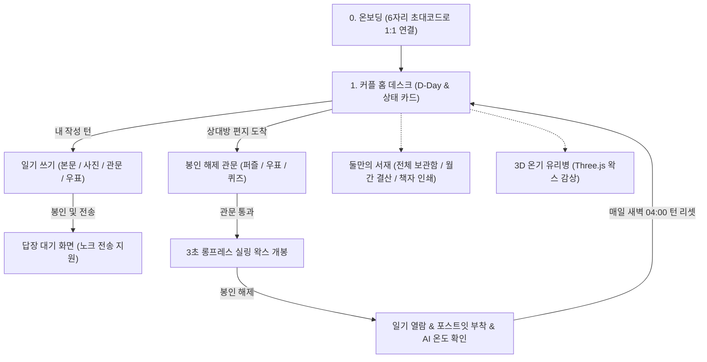

# 💌 온기 (Warmth) — 둘만의 아날로그 비밀 교환일기

<p align="center">
  
</p>

<p align="center">
  <strong>"서재 책상 위에 놓인 가죽 양장 다이어리와 편지 봉투. 하루걸러 쓰는 턴제 비밀 교환일기"</strong><br />
  인스턴트 메신저의 즉답 피로에서 벗어나, 기다림의 설렘과 손편지의 따스한 온기를 전합니다.
</p>

<p align="center">
  <a href="https://meisteryi.github.io/Warmth/"></a>
  
  
  
  
  
  
  
</p>

---

## 📖 서비스 소개 (About Warmth)

> **"소중한 사람들과 실제로 주고받기 위해 만들고 다듬어온 프로덕션 레벨의 웹 애플리케이션입니다."**

**온기(Warmth)**는 둘만의 6자리 고유 코드로 안전하게 연결되어 편지를 번갈아 주고받는 **턴제(Turn-based) 아날로그 교환일기**입니다.  
디지털 화면 속에서도 한 장의 종이를 만지는 듯한 서정적 감성을 위해 **종단간 암호화(E2EE), Web Audio 절차적 사운드, 3D 온기 유리병, Web Push 알림, AI 온기 지수 측정** 등 기술적 디테일을 정교하게 녹여냈습니다.

---

## 🌟 핵심 기능 및 사용자 경험 (Key Features)

### 🕯️ 3초 롱프레스 실링 왁스 (Wax Seal Interaction)
- 편지 봉투에 찍힌 실링 왁스를 **3초간 길게 누르면(Long-press)** 시각·청각·촉각 피드백과 함께 왁스가 사르르 녹아내리며 편지가 개봉됩니다.
- **Web Audio API 절차적 사운드 합성**: 외부 음원 파일 로딩 없이 브라우저 오디오 노드로 왁스가 지글지글 끓어오르는 저주파 험(`Melt Hum`)과 쩍 갈라지는 파열음(`Wax Crack`), 햅틱 진동을 완벽히 연출합니다.

### 🏺 3D 기억의 온기 유리병 (Three.js 3D Memory Jar)
- 편지를 주고받을 때마다 둘만의 추억이 담긴 형형색색의 실링 왁스 조각들이 유리병 안으로 사르르 떨어집니다.
- **반응형 3D 인터랙션**: 마우스 드래그 및 터치로 유리병을 360도 회전하며 감상할 수 있고, 왁스 알갱이를 터치하면 해당 일기로 바로 이동합니다.

### 🧩 3대 봉인 해제 관문 (Unlock Mission Gates)
편지를 읽기 전, 상대방이 지정한 다정한 미션을 통과해야만 왁스 봉인을 풀 수 있습니다:
1. **🧩 사진 슬라이딩 퍼즐 (Photo Sliding Puzzle)**: 첨부한 사진이 3×3 조각으로 분리되어 손끝으로 맞추는 추억 복원 퍼즐.
2. **📮 빈티지 찢긴 우표 직소 퍼즐 (Torn Stamp Puzzle)**: 대한제국 앤틱 우표가 무작위로 찢겨 흩어지며 회전과 결합으로 완성하는 퍼즐.
3. **❓ AI 감성 추억 퀴즈 (Surprise Memory Quiz)**: 지난 편지들을 바탕으로 Gemini AI가 출제하는 둘만의 소소한 과거 회상 퀴즈.

### 🌡️ Gemini AI 온기 지수 & 감성 해시태그
- **정서적 공기감 분석**: 단순 단어 매칭이 아닌, 글 전체의 서사와 감정의 결을 Gemini 모델이 심층 분석하여 **-20.0°C ~ 40.0°C의 온기 온도**를 측정합니다.
- **다정한 한 줄 헌사 & 키워드**: 글의 분위기를 함축한 시적 코멘트와 감성 해시태그를 일기에 새겨줍니다.

### 📮 둘만의 보관된 서재 & 월말 온기 결산 (Monthly Warmth Recap)
- **둘만의 서재**: 서로 주고받은 모든 편지를 날짜별, 작성자별로 한눈에 읽어볼 수 있는 아늑한 양장본 서재 인라인 뷰.
- **매월 말일 단 한 번의 종합 결산**: 말일이 되면 그달의 모든 일기를 종합하여 **이달의 평균 온기 지수, 대표 우표, 온도 흐름 SVG 차트, 35mm 빈티지 카메라 필름 롤**을 단 한 번 영구 생성합니다.
- **결정론적 35mm 필름 롤**: 상하 스프로킷 구멍이 뚫린 암실 필름 프레임에 사진들을 무작위 셔플하여 고정 배치합니다.

### 🏷️ 1:1 독립 포스트잇(Post-it) & 실시간 자동 임시저장
- **방 & 일기 & 작성자별 1:1 격리**: 일기마다 개별 부착되는 포스트잇 반응으로, 다른 일기나 상대방 화면에 메모가 절대 섞이지 않습니다.
- **기기 재부팅 복구**: 작성 중 브라우저를 닫거나 폰을 껐다 켜도 작성 중이던 메모가 100% 안전하게 복원되며, 부착 즉시 깔끔하게 정리됩니다.
- **미개봉 스포일러 차단**: 상대방이 왁스를 깨기 전까지는 포스트잇 내용이 메모리 레벨에서도 완전히 가려집니다.

### 🔔 실시간 웹 푸시 & 바람 종소리 노크 (Windchime Knock)
- **OS 네이티브 푸시 알림**: 앱을 닫아두어도 새 편지 도착, 편지 개봉, 노크 알림이 백그라운드 푸시로 전달됩니다. (VAPID 키 자동 복구 및 교체 지원)
- **감성 노크(Knock)**: 편지를 보채지 않고 맑은 윈드차임 풍경 소리와 함께 가볍게 노크를 띄웁니다.

### 🖨️ 소책자 PDF 인쇄 (Booklet Printable)
- 둘만의 기념일(100일, 1주년)을 기념하여 모은 일기들을 표지, 목차, 본문 사진이 포함된 정갈한 종이책 레이아웃으로 즉시 인쇄하거나 PDF 파일로 평생 소장할 수 있습니다.

---

## 🔄 턴제 교환 흐름도 (State Machine Architecture)


```mermaid
flowchart TD
    A["0. 온보딩 (6자리 초대코드로 1:1 연결)"] --> B["1. 커플 홈 데스크 (D-Day & 상태 카드)"]
    B -->|"내 작성 턴"| C["일기 쓰기 (본문 / 사진 / 관문 / 우표)"]
    B -->|"상대방 편지 도착"| D["봉인 해제 관문 (퍼즐 / 우표 / 퀴즈)"]
    C -->|"봉인 및 전송"| E["답장 대기 화면 (노크 전송 지원)"]
    D -->|"관문 통과"| F["3초 롱프레스 실링 왁스 개봉"]
    F -->|"봉인 해제"| G["일기 열람 & 포스트잇 부착 & AI 온도 확인"]
    G -->|"매일 새벽 04:00 턴 리셋"| B
    B -.-> H["둘만의 서재 (전체 보관함 / 월간 결산 / 책자 인쇄)"]
    B -.-> I["3D 온기 유리병 (Three.js 왁스 감상)"]
```

---

## 🛡️ 보안 및 아키텍처 원칙 (Security & Architecture)

1. **종단간 암호화 (E2EE - End-to-End Encryption)**
   - 모든 일기 제목, 본문, 사진 캡션, 노크 메시지는 클라이언트 단에서 방 고유 솔트(Salt)와 암호화 키로 AES 수준 암호화된 후 Firestore에 저장됩니다.
   - 서버나 데이터베이스 관리자조차 둘만의 비밀 일기를 평문으로 열람할 수 없습니다.

2. **클라이언트 사이드 메모리 마스킹**
   - 아직 왁스를 깨지 않은 미개봉 편지는 개발자 도구(F12 / Network 탭)를 통해서도 본문과 사진을 엿볼 수 없도록 리액트 상태 레벨에서 원천 마스킹됩니다.

3. **원자적 트랜잭션 (Atomic Concurrency Control)**
   - 두 사람이 동시에 편지를 작성하거나 전송하더라도 Firestore `runTransaction`을 통해 턴 충돌(Race Condition)을 완벽하게 방지합니다.

---

## 🛠 기술 스택 (Tech Stack)

| 영역 | 기술 스택 | 적용 목적 |
|:---|:---|:---|
| **Frontend Framework** | **Next.js 16 (Turbopack, App Router)** | 고속 컴파일 파이프라인, SSR 및 정적 배포(`output: export`) 양방향 지원 |
| **Language** | **TypeScript 5.x** | 엄격한 인터페이스 정의를 통한 일기 및 상태 머신 무결성 보장 |
| **Styling** | **Tailwind CSS v4 & Vanilla CSS** | 리넨 한지 질감(`paper-texture`), 앤틱 실링 왁스 셰이딩, 무한 롤링 마키 |
| **3D Graphics** | **Three.js & React Canvas** | 360도 인터랙티브 3D 온기 유리병 및 실링 왁스 렌더링 |
| **Motion & FX** | **Framer Motion & Canvas-Confetti** | 부드러운 스르륵 화면 전환, 모달 애니메이션, 축하 파티클 |
| **Audio Engine** | **Web Audio API** | 저주파 왁스 험, 크랙 타격음, 풍경 종소리 절차적 오디오 실시간 합성 |
| **Database & Sync** | **Firebase Cloud Firestore** | `onSnapshot` 기반 실시간 1:1 양방향 동기화 및 E2EE 데이터 저장 |
| **AI Engine** | **Google Gemini 3.5 Flash Lite** | 입체적 감정 온도 측정, 시적 한 줄 코멘트, 월간 회고록 총평 생성 |
| **Push Notification** | **Web Push API & Service Worker** | 백그라운드 PWA 환경에서 실시간 편지 도착 알림 및 VAPID 서명 |
| **Deployment & CI/CD** | **Vercel & GitHub Actions** | Vercel 서버리스 호스팅 및 GitHub Pages 정적 배포 이중화 지원 |

---

## 📁 프로젝트 구조 (Directory Structure)

```text
Warmth/
├── .github/workflows/          # GitHub Actions CI/CD 파이프라인 (deploy.yml)
├── public/                     # PWA manifest, 서비스 워커, 폰트, 오디오 에셋
│   ├── manifest.json           # iOS/Android 홈 화면 PWA 설정
│   └── sw.js                   # 백그라운드 웹 푸시 알림 수신 서비스 워커
├── src/
│   ├── app/
│   │   ├── api/                # Gemini AI 및 Web Push VAPID API 엔드포인트
│   │   ├── globals.css         # 리넨 질감, 명조 폰트, 실링 왁스 애니메이션
│   │   ├── layout.tsx          # 뷰포트, PWA 메타데이터, 다국어 설정
│   │   └── page.tsx            # 메인 상태 머신 오케스트레이터 및 모달 제어
│   ├── components/
│   │   ├── ArchiveModal.tsx         # 둘만의 서재 (보관함, 월말 결산, 35mm 필름 롤, 소책자)
│   │   ├── EmptyDeskView.tsx        # 첫 일기 작성 전 아늑한 초기 책상 뷰
│   │   ├── Envelope.tsx             # 앤틱 편지 봉투 및 AIR MAIL 소인 렌더러
│   │   ├── HomeView.tsx             # 메인 D-Day 카드, 롤링 상태 배너, 빠른 액션
│   │   ├── KnockNotificationModal.tsx # 실시간 풍경 종소리 노크 모달
│   │   ├── MissionModal.tsx         # 3대 봉인 해제 관문 통합 모달
│   │   ├── OnboardingView.tsx       # 6자리 초대코드 발급 및 1:1 페어링
│   │   ├── OpenedLetter.tsx         # 양장 다이어리 편지 뷰어, 1:1 포스트잇
│   │   ├── PhotoSlidingPuzzle.tsx   # 3×3 사진 조각 맞추기 관문
│   │   ├── RoomHeader.tsx           # 상단바 (온기 로고, 방코드, 언어, 서재/유리병 전환)
│   │   ├── StampJigsawPuzzle.tsx    # 4조각 찢김 우표 직소 퍼즐 관문
│   │   ├── WaitingLetter.tsx        # 상대방 턴 대기 화면 (노크 전송)
│   │   ├── WaxSeal.tsx              # 3초 롱프레스 실링 왁스 인터랙션
│   │   └── WriteDiaryModal.tsx      # 일기 작성, 사진 업로드, 관문 지정 모달
│   ├── features/
│   │   └── memory-jar-3d/           # Three.js 기반 3D 온기 유리병 뷰
│   ├── lib/
│   │   ├── audio.ts            # Web Audio API 절차적 사운드 합성기
│   │   ├── crypto.ts           # 종단간(E2EE) 암호화 및 복호화 엔진
│   │   ├── dateUtils.ts        # 새벽 04:00 기준 턴 판별 및 D-Day 계산기
│   │   ├── firebase.ts         # Firebase SDK 클라이언트 초기화
│   │   ├── gemini.ts           # Gemini AI 감정 분석 및 월말 회고 내러티브 생성
│   │   ├── notifications.ts    # 웹 푸시 권한, VAPID 키 회전 및 구독 복구
│   │   └── roomService.ts      # Firestore 실시간 CRUD 및 원자적 트랜잭션
│   └── types/
│       └── diary.ts            # 일기, 미션, 반응, 월간 결산 TypeScript 타입 정의
├── firestore.rules             # Firestore 보안 규칙 (데이터 격리 및 인덱싱)
├── next.config.ts              # Next.js 빌드 설정
└── README.md
```

---

## 🚀 로컬 개발 및 실행 (Getting Started)

### 1. 저장소 클론 및 의존성 설치
```bash
git clone https://github.com/meisteryi/Warmth.git
cd Warmth
npm install
```

### 2. 환경 변수 설정
프로젝트 루트에 `.env.local` 파일을 생성하고 아래 설정값을 입력합니다:

```env
# FIREBASE CONFIG
NEXT_PUBLIC_FIREBASE_API_KEY=your_firebase_api_key
NEXT_PUBLIC_FIREBASE_AUTH_DOMAIN=your_project.firebaseapp.com
NEXT_PUBLIC_FIREBASE_PROJECT_ID=your_project_id
NEXT_PUBLIC_FIREBASE_STORAGE_BUCKET=your_project.firebasestorage.app
NEXT_PUBLIC_FIREBASE_MESSAGING_SENDER_ID=your_messaging_sender_id
NEXT_PUBLIC_FIREBASE_APP_ID=your_app_id

# GEMINI AI
GEMINI_API_KEY=your_gemini_api_key

# WEB PUSH VAPID KEYS
NEXT_PUBLIC_VAPID_PUBLIC_KEY=your_vapid_public_key
VAPID_PRIVATE_KEY=your_vapid_private_key
VAPID_SUBJECT=mailto:your_email@example.com
```

### 3. 개발 서버 실행
```bash
npm run dev
```
브라우저에서 `http://localhost:3000`으로 접속하여 즉시 테스트할 수 있습니다.

### 4. 프로덕션 빌드 및 전수 무결성 검증
```bash
# Next.js 프로덕션 빌드
npm run build

# 암복호화, 알림, 서재, 포스트잇 종합 무결성 진단
NODE_PATH=./node_modules npx tsx --env-file=.env.local .gemini/antigravity/.../diagnose_all_systems.ts
```

---

## 📬 제작자 정보 (Creator & Contact)

- **Developer**: 이주형 (Joohyoung Yi / meisteryi)
- **Email**: [yjh020701@gmail.com](mailto:yjh020701@gmail.com)
- **GitHub**: [@meisteryi](https://github.com/meisteryi)
- **Live Service**: [https://meisteryi.github.io/Warmth/](https://meisteryi.github.io/Warmth/)

---

## 📜 라이선스 (License)

This project is licensed under the MIT License.  
Copyright (c) 2026 Joohyoung Yi (meisteryi). All rights reserved.
